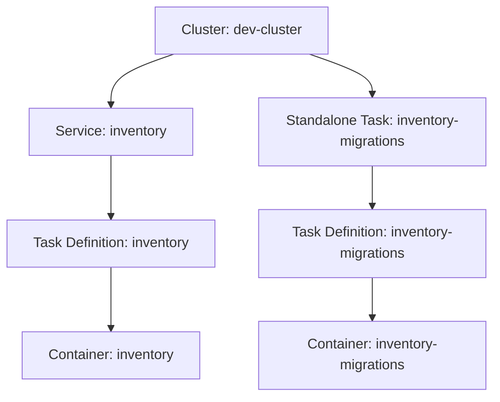

# ECSify - MVP System Design & Development Plan

## 1. Overview
ECSify is a CLI tool to simplify deployment of containers to AWS ECS. Its goal is to abstract ECS complexity while keeping the process GitOps-friendly, minimal, and practical.  

The MVP focuses on:
- Multi-service and multi-task definition deployment  
- YAML-based configuration with file convention merging
- Multi-environment support via file overrides
- Automatic creation/updating of task definitions and services  

**Key Principles:**
- **Minimalism:** Only essential ECS parameters are exposed in MVP (task, service, replicas, cluster, image).  
- **Simplicity:** Avoid unnecessary abstraction.  
- **Flexibility:** Deploy all services or target specific ones.

---

## 2. YAML Specification (MVP)

```yaml
tasks:
  - family: inventory
    container:
      name: inventory
      image: myrepo/inventory:latest
      port: 8080

  - family: inventory-migrations
    container:
      name: inventory-migrations
      image: myrepo/inventory:latest
      command: ["rake", "db:migrate"]

services:
  - name: inventory
    cluster: dev-cluster
    replicas: 2
    task_family: inventory
```

**Multi-environment convention**

ecsify.yaml → base configuration

ecsify.dev.yaml, ecsify.staging.yaml, ecsify.prod.yaml → include base and override values

Optional dynamic ecsify.branch.yaml for ephemeral environments

## 3. ECS Deployment Model
Conceptual organization of ECS resources:



* Cluster: Logical grouping of services
* Service: Manages long-running tasks (replicas, scaling, networking)
* Task Definition: Blueprint describing containers, resources, roles
* Task: Running instance of a Task Definition

## 4. ECSify CLI Behavior

### `ecsify apply`
**Default behavior** - deploys ALL services using only base configuration:
1. Load base configuration (ecsify.yaml)
2. No environment overrides applied
3. Validate cluster exists (error if not)
4. Create/Update all task definitions
5. Create/Update all services
6. Wait for deployments to complete

### `ecsify apply --env <environment>`
**Deploys ALL services** with environment overrides:
1. Load base configuration (ecsify.yaml)
2. Load environment overrides (ecsify.<env>.yaml) 
3. Merge configurations (deep merge)
4. Deploy all services with merged config

### `ecsify apply --service <service-name>`
**Deploys SPECIFIC service** using base config only:
1. Load base configuration
2. Filter to only specified service and its required tasks
3. Deploy only that service

### `ecsify apply --service <service-name> --env <environment>`
**Deploys SPECIFIC service** with environment overrides:
1. Load and merge configurations
2. Filter to only specified service and its required tasks
3. Deploy only that service with merged config

### `ecsify apply --file <file>`
**Custom file support** (base config only):
- Uses <file> as base instead of ecsify.yaml
- No environment overrides applied

### `ecsify apply --file <file> --env <environment>`
**Custom file with environment overrides**:
- Uses <file> as base instead of ecsify.yaml
- Looks for <file>.<env>.yaml for overrides
- Example: `--file api.yaml --env prod` loads api.yaml + api.prod.yaml

### `ecsify apply --dry-run [other-options]`
Output JSON/YAML plan of what would be created/updated without executing

## 6. Networking & Roles
Services inherit networking (VPC, subnets, security groups) from environment variables specified above.

ECSify MVP assumes networking and IAM roles are provided by the user via environment variables.

## 7. Multi-Environment File Convention

### File Structure
```
project/
├── ecsify.yaml              # Base configuration
├── ecsify.dev.yaml          # Development overrides  
├── ecsify.staging.yaml      # Staging overrides
├── ecsify.prod.yaml         # Production overrides
└── ecsify.branch.yaml       # Optional: branch-specific overrides
```

### Merge Strategy
- **Objects**: Deep merge (environment overrides extend base)
- **Arrays/Primitives**: Replace (environment overrides replace base completely)
- **Environment Variables**: `${VAR}` substitution after merge

### Example Merge Behavior
```yaml
# ecsify.yaml (base)
services:
  - name: inventory
    replicas: 1
    cluster: dev-cluster

# ecsify.prod.yaml (override)  
services:
  - name: inventory
    replicas: 5
    cluster: prod-cluster

# Result after merge:
services:
  - name: inventory
    replicas: 5          # Replaced
    cluster: prod-cluster # Replaced
```

## 8. Comparison with Other Tools

### vs Terraform
- **Terraform**: Full infra-as-code, manages networking, IAM, etc.
- **ECSify**: Focuses only on ECS service + task lifecycle, faster feedback loop, minimal config.
- **Relationship**: ECSify complements Terraform, not replaces it.

### vs Kubernetes Tools (kubectl, ArgoCD, Flux)
- **K8s**: Native declarative GitOps workflow, built-in CRDs for deployments/services.
- **ECSify**: Brings a similar declarative experience to ECS, with less boilerplate.

## 9. Development Phases (MVP Roadmap)

### Phase 1 - Core CLI (MVP Minimal)
**Timeline: 1 week**
- Parse ecsify.yaml (base configuration only)
- YAML validation with Pydantic models
- Register task definitions in AWS ECS  
- Create/update services (all services in YAML)
- Basic logging and error handling
- Commands: `ecsify apply` and `ecsify apply --dry-run` only

### Phase 2 - Environment Support & Service Selection
- Add `--env <environment>` support with file convention merging
- Add `--service <name>` for selective deployment
- Add `--file <custom>` for custom base files
- Environment variable substitution `${VAR}`

### Phase 3 - UX Improvements
- Improve output messages (clear plan/apply UX)
- Better error handling and validation
- Service health check monitoring

### Phase 4 - Advanced Features
- YAML anchors support for reusability
- Custom file includes (!include)
- Dependency management between services

### Phase 5 - Future Enhancements (Post-MVP)
- Auto-create VPC/networking if missing
- Run standalone tasks (ecsify run-task)
- ECSify as a GitOps operator (listen to git events)
- Load balancer integration

## 10. Final MVP Result
Once the MVP is complete, ECSify will support:

- **Multi-service YAML deployments** with minimal required fields (cluster, service, task, image, replicas)
- **File convention merging** for environment-specific configurations
- **Selective deployment**: Deploy all services or target specific ones
- **Automatic infrastructure management**: Task definition registration and service creation/updates
- **Environment variable substitution** inside YAML (`${VAR}`)
- **AWS integration**: VPC, subnets, security groups, IAM roles via environment variables

### Clear CLI UX (Full MVP):
- `ecsify apply` → deploys all services using base configuration only
- `ecsify apply --dry-run` → shows deployment plan without executing

### Clear CLI UX (Post Phase 1):
- `ecsify apply --env prod` → deploys all services with production overrides  
- `ecsify apply --service inventory` → deploys only inventory service (base config)
- `ecsify apply --service inventory --env dev` → deploys only inventory service with dev overrides  
- `ecsify apply --file custom.yaml --env staging` → uses custom config with staging overrides

This makes ECSify a **lightweight, multi-service GitOps tool for ECS**, positioned between manual AWS CLI usage and heavy infrastructure tools like Terraform.

## 11. Technical Implementation Details

### Technology Stack
- **Language**: Python 3.9+
- **CLI Framework**: Click (command-line interface)
- **Data Validation**: Pydantic (YAML schema validation)
- **AWS SDK**: boto3 (ECS API integration)
- **YAML Parsing**: PyYAML (configuration parsing)
- **Output Formatting**: Rich (colors, progress, styling)
- **Error Handling**: Standard Python exceptions

### Dependencies (requirements.txt)
```
click>=8.0.0
pydantic>=2.0.0
boto3>=1.28.0
PyYAML>=6.0
rich>=13.0.0
```

### Project Structure
```
ecsify/
├── cli.py                   # Click CLI entrypoint
├── models/                  # Pydantic data models
│   ├── __init__.py
│   ├── task.py             # Task definition models
│   ├── service.py          # Service definition models
│   └── config.py           # Root configuration model
├── parsers/                 # YAML parsing + validation
│   ├── __init__.py
│   ├── yaml_parser.py      # YAML file parsing
│   └── validator.py        # Configuration validation
├── aws/                     # AWS API clients
│   ├── __init__.py
│   ├── ecs_client.py       # ECS service wrapper
│   └── auth.py             # AWS credentials handling
├── deployment/              # Deployment orchestration
│   ├── __init__.py
│   ├── deployer.py         # Main deployment logic
│   └── dry_run.py          # Dry-run plan generation
├── utils/                   # Utilities
│   ├── __init__.py
│   ├── merge.py            # Configuration merging
│   ├── logger.py           # Logging setup
│   └── exceptions.py       # Custom exception classes
├── tests/                   # Test suite
├── examples/                # Example configurations
├── setup.py                # Package setup
└── requirements.txt        # Dependencies
```

## 12. Output & User Experience

### CLI Output Style (kubectl-inspired)
```bash
$ ecsify apply
[2025-01-15 10:30:15] 🔍 Validating ecsify.yaml...
[2025-01-15 10:30:15] ✅ YAML validation passed
[2025-01-15 10:30:16] 🔑 AWS credentials verified (region: us-east-1)
[2025-01-15 10:30:16] 🎯 ECS cluster 'dev-cluster' exists
[2025-01-15 10:30:17] 📝 Registering task definition 'inventory'...
[2025-01-15 10:30:18] ✅ Task definition 'inventory:3' registered
[2025-01-15 10:30:18] 🚀 Updating service 'inventory'...
[2025-01-15 10:30:19] ⏳ Waiting for deployment (0/2 tasks running)
[2025-01-15 10:30:35] ✅ Service 'inventory' deployed (2/2 tasks running)
[2025-01-15 10:30:35] 🎉 All deployments completed successfully
```

### Dry-run Output
```bash
$ ecsify apply --dry-run
[2025-01-15 10:30:15] 🔍 Validating ecsify.yaml...
[2025-01-15 10:30:15] ✅ YAML validation passed

📋 Deployment Plan:
━━━━━━━━━━━━━━━━━━━━━━━━━━━━━━━━━━━━━━━━━━━━━

Task Definitions to Register:
  • inventory (image: myrepo/inventory:latest, cpu: 256, memory: 512)

Services to Deploy:
  • inventory (cluster: dev-cluster, replicas: 2 → 2)

🎯 No changes required - all resources up to date
```

### JSON Output for Automation
```bash
$ ecsify apply --json
{
  "status": "success",
  "timestamp": "2025-01-15T10:30:35Z",
  "duration_seconds": 20,
  "task_definitions": [
    {"family": "inventory", "revision": 3, "status": "registered"}
  ],
  "services": [
    {"name": "inventory", "status": "deployed", "running_tasks": 2, "desired_tasks": 2}
  ]
}
```

## 13. Validation & Security

### YAML Schema Validation (Pydantic Models)
```python
from pydantic import BaseModel, Field
from typing import List, Optional

class ContainerSpec(BaseModel):
    name: str
    image: str
    port: int = 80
    cpu: int = Field(default=256, ge=128)  # Minimum 128 CPU units
    memory: int = Field(default=512, ge=128)  # Minimum 128 MB
    command: Optional[List[str]] = None
    env: Optional[dict] = None

class TaskDefinition(BaseModel):
    family: str = Field(..., min_length=1)
    container: ContainerSpec
    execution_role_arn: Optional[str] = None
    task_role_arn: Optional[str] = None

class ServiceDefinition(BaseModel):
    name: str = Field(..., min_length=1)
    cluster: str = Field(..., min_length=1)
    replicas: int = Field(default=1, ge=1)
    task_family: str = Field(..., min_length=1)

class ECSifyConfig(BaseModel):
    tasks: List[TaskDefinition]
    services: List[ServiceDefinition]
```

### AWS Pre-deployment Checks
- ✅ **AWS Credentials**: Verify AWS credentials and permissions
- ✅ **ECS Cluster**: Validate cluster existence
- ✅ **IAM Roles**: Check execution and task role existence (if specified)
- ✅ **Networking**: Validate VPC, subnets, security groups via environment variables
- ✅ **Container Images**: Optional check for image existence in registry
- ✅ **Resource Limits**: Validate CPU/memory combinations per ECS constraints

### Error Handling Strategy
```python
class ECSifyError(Exception):
    """Base exception for all ecsify errors"""
    pass

class ValidationError(ECSifyError):
    """YAML validation or configuration error"""
    pass

class AWSError(ECSifyError):
    """AWS API or authentication error"""
    pass

class DeploymentError(ECSifyError):
    """Deployment process failure"""
    pass

class TimeoutError(ECSifyError):
    """Deployment timeout"""
    pass
```

## 14. Complete YAML Specification

### Base Configuration with All ECS Parameters
```yaml
# ecsify.yaml - Complete base configuration
tasks:
  - family: inventory
    container:
      name: inventory
      image: myrepo/inventory:latest
      port: 8080
      cpu: 256                          # CPU units (required)
      memory: 512                       # Memory in MB (required)
      env:                              # Environment variables
        LOG_LEVEL: info
        PORT: "8080"
        APP_NAME: inventory
      secrets:                          # Optional: secret env vars
        DATABASE_URL: "{{env.DATABASE_URL}}"
        JWT_SECRET: "{{env.JWT_SECRET}}"
    
    # IAM roles (optional - will use defaults if not specified)
    execution_role_arn: "{{env.EXECUTION_ROLE_ARN}}"
    task_role_arn: "{{env.TASK_ROLE_ARN}}"
    
    # Networking (passed via environment variables)
    vpc_config:
      vpc_id: "{{env.VPC_ID}}"
      subnet_ids: 
        - "{{env.SUBNET_1}}"
        - "{{env.SUBNET_2}}"
      security_groups:
        - "{{env.SECURITY_GROUP_ID}}"
    
    # Health check configuration
    health_check:
      path: "/health"
      interval: 30
      timeout: 5
      healthy_threshold: 2
      unhealthy_threshold: 3

  - family: inventory-migrations
    container:
      name: inventory-migrations
      image: myrepo/inventory:latest
      cpu: 128
      memory: 256
      command: ["rake", "db:migrate"]
      env:
        DATABASE_URL: "{{env.DATABASE_URL}}"

services:
  - name: inventory
    cluster: dev-cluster
    replicas: 2
    task_family: inventory
    
    # Optional: service-specific networking
    load_balancer:
      enabled: false                    # MVP: no load balancer support
    
    # Optional: placement constraints
    placement_strategy:
      type: spread
      field: attribute:ecs.availability-zone
```

### Environment Override Example
```yaml
# ecsify.prod.yaml - Production overrides
services:
  - name: inventory
    cluster: prod-cluster
    replicas: 5                         # Scale up for production

tasks:
  - family: inventory
    container:
      cpu: 512                          # More CPU for production
      memory: 1024                      # More memory for production
      env:
        LOG_LEVEL: error                # Less verbose logging
        
    health_check:
      interval: 15                      # More frequent health checks
      timeout: 3                        # Stricter timeouts
```

### Required Environment Variables
```bash
# Infrastructure (must exist)
export VPC_ID="vpc-xxxxxxxxx"
export SUBNET_1="subnet-xxxxxxxxx" 
export SUBNET_2="subnet-yyyyyyyyy"
export SECURITY_GROUP_ID="sg-xxxxxxxxx"

# IAM (optional - will create defaults if not provided)
export EXECUTION_ROLE_ARN="arn:aws:iam::account:role/ecsTaskExecutionRole"
export TASK_ROLE_ARN="arn:aws:iam::account:role/ecsTaskRole"

# Application secrets
export DATABASE_URL="postgres://prod.db.com/inventory"
export JWT_SECRET="your-jwt-secret-key"
export REDIS_URL="redis://prod.redis.com:6379"

# AWS (optional - can use default profile)
export AWS_REGION="us-east-1"
export AWS_PROFILE="production"
```

This comprehensive specification provides all technical details needed to begin Phase 1 implementation.